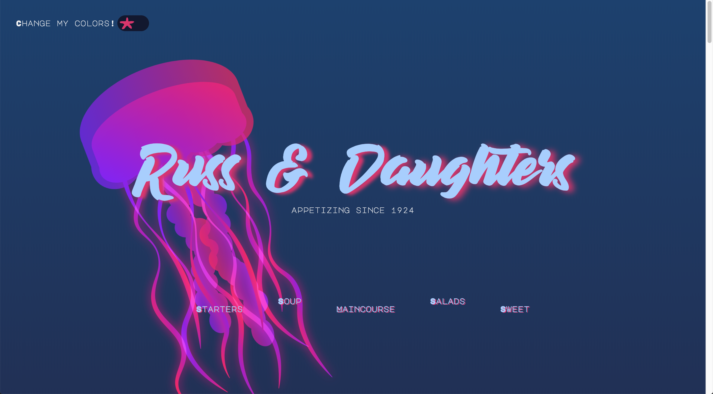
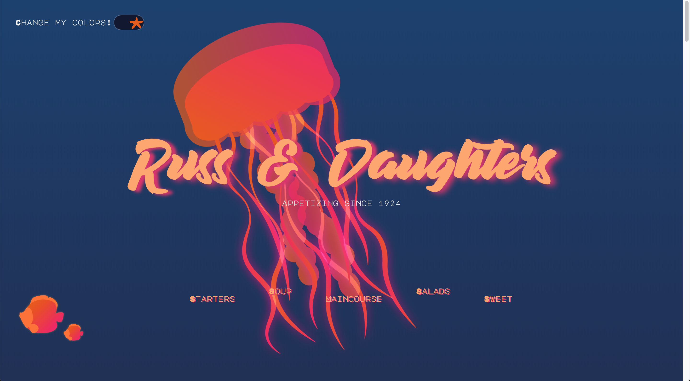
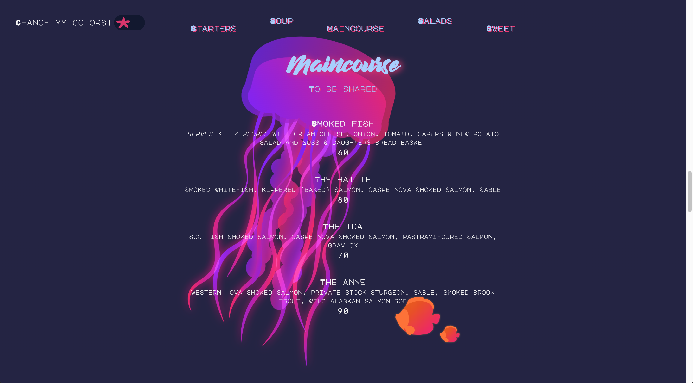

# CSS to the Rescue @cmda-minor-web 18-19

**For this course I created an menu interactive menu page. The theme being mostly seafood.**







## Concept

I wanted to create an interactive restaurant menu that mostly consisted of seafood. The page couldn't contain regular shapes so I decided to make my main shape a jellyfish. Just because I think they're pretty cool. Another restriction was that the menu had to be based on the weather, so I choose the wind-direction of Amsterdam to show how my page reacts to the weather. 


## Learning Process 

The methodology I used to build my css structure was SMACSS. I never heard of this methodology before, so I had to dive deep into the subject matter. 

This course I learned a lot about specificity and SMACSS and other methodology's like BEM. My personal focus lay on creating a page using only css, which proved to be quite difficult because I always thought of a javascript solution first. However I was pleasantly suprised by all you can do with only css, not needing any javascript. In the end I only used javascript to fetch the wind direction and setting up some css variables. I also wanted to dive deeper into SVG animation's, since I never done this before. Although there are a lot of javascript libraries that could make smoother animations, I did come a long way to create the thing I wanted. 

I found creating interaction on my page the hardest thing to come up with. And would have loved to have more meaningfull interaction, just so I could explore the limits of only using css. Another thing that didn't work out was using ```shape-outside``` on my sections, to create a more fluid like environment. 

## License
This repository is licensed as [MIT](LICENSE) by [Chelsea Doeleman](https://github.com/chelseadoeleman).